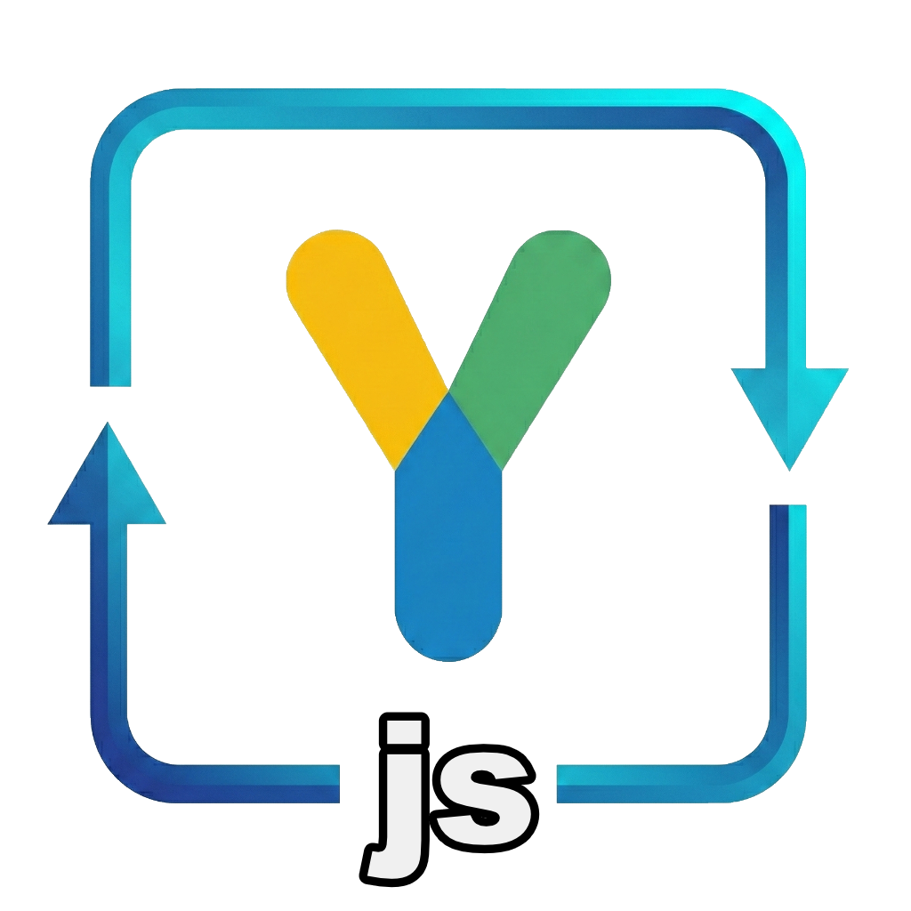

  
  <h1 align="center">pojo-yjs</h1>

  <i>Use Y.js types as if they were plain JavaScript objects using Proxies</i>

  
  
  
   
  
  

> ### Full documentation can be found on the site:
>
> ## [pojo-yjs.js.org](https://pojo-yjs.js.org)

## Introduction

`pojo-yjs` makes working with Y.js types (Maps, Arrays, etc.) as easy as working with plain JavaScript objects. By using Proxies, it provides a seamless developer experience where you can read and write to your shared data structures using standard object and array syntax, while `pojo-yjs` handles the underlying Y.js operations automatically.

By using `pojo-yjs`, you get:

- **Proxy-based API:** Interact with Y.js types using standard JS object and array syntax.
- **Automatic Synchronization:** Changes made to the proxy are automatically reflected in the underlying Y.js types.
- **Type Safety:** Full TypeScript support for your shared data structures.
- **Lightweight:** Minimal overhead over Y.js.

### Installation

Core package:

> `npm install pojo-yjs yjs`

> `yarn add pojo-yjs yjs`

> `pnpm add pojo-yjs yjs`

For Y.js integration (optional):

